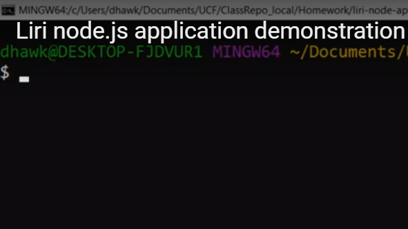

# liri-node-app
liri-node-app is a command line program that pulls info from the Online Movie Database API, Spotify API, and Bands in Town API.

# Overview
This application uses node with the axios npm package to pull data from the bands in town API and and Open Movie Database, and the spotify npm package, to get data based on a command entered and a search term. 

# Instruction
The liri-node-app takes in four main parameters from the command line: 
> node liri (command) (search term)

The four commands available are:
* movie-this
* spotify-this-song
* concert-this
* do-what-it-says

Example: 
> node liri movie-this forrest gump

Output:

# Demonstration

# Links
Links with a deployed version of the app will go here

# Technologies Used
List of technologies used will go here

# About Me
About me section will go here